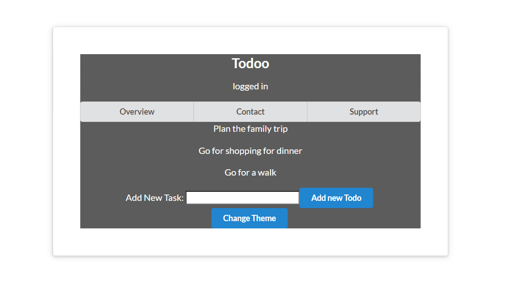

# Todoo(WebApp)

**Todoo** is a basic React-based web application for managing tasks. It allows users to add, view, and delete tasks. Additionally, the application has a dynamic theme-switching feature.



## Features

1. **Add and Remove Tasks**:
    - Tasks can be added using the input bar and the "Add new Todo" button.
    - Click on a task to remove it from the list.

2. **Dynamic Theme Switching**:
    - Toggle between themes by clicking the "Change Theme" button.

3. **React Context and Hooks**:
    - The application uses **React Context API** for managing state across components.
    - Custom hooks such as `useReducer` and `createContext` are used for task management and theme control.

## Project Structure

```
├── Components
│   ├── Navbar.js
│   ├── TodoList.js
├── Contexts
│   ├── AuthContext.js
│   ├── ThemeContext.js
│   ├── TodoListContext.js
├── Reducers
│   ├── todosReducer.js
```

### Explanation of Key Features

- **Context API**:
    - `AuthContext.js`: Manages user authentication status.
    - `ThemeContext.js`: Controls the application's theme.
    - `TodoListContext.js`: Manages the list of tasks.

- **useReducer Hook**:
    - The `todosReducer.js` file manages the state transitions (add/remove tasks). It provides a robust way to handle complex state logic.

- **Custom Components**:
    - `Navbar.js`: Displays navigation options.
    - `TodoList.js`: Manages and displays the list of tasks.

## Running Todoo Locally

Follow these steps to set up and run the application on your computer:

### Prerequisites
- Node.js and npm will need to be installed on your system.

### Steps

1. Clone this repository:
   ```bash
   git clone https://github.com/your-username/todoo.git
   cd todoo
   ```

2. Install dependencies:
   ```bash
   npm install
   ```

3. Start the development server:
   ```bash
   npm start
   ```

4. Open your browser and navigate to:
   ```
   http://localhost:3000
   ```

## Contributions
Contributions are welcome! Feel free to open issues or create pull requests to improve this project.

## License
This project is licensed under the MIT License.
